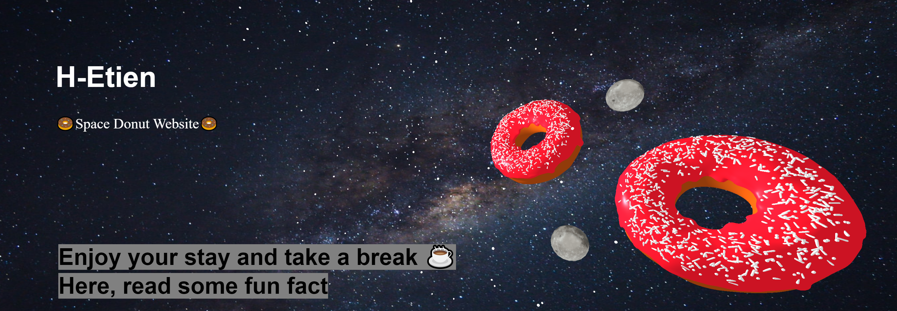

# first-three

Projet avec **Three.js**.

Lien vers le site :
<https://space-donut.netlify.app>

---

&nbsp;

**_Premier pas avec Three.js._**

Html/css basique avec incorporation de modèle 3D venu de Blender.

Rotation des lunes et des donuts autour d'un même point.

Utilisation de vite comment boilerplate.
